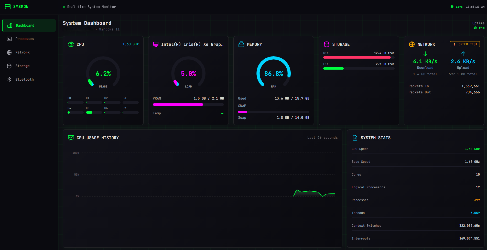

# System Monitor

A cyberpunk-styled real-time system monitoring dashboard built with FastAPI and vanilla JavaScript.


## Features

- 🖥️ **Dashboard** - Real-time CPU, Memory, Disk, and Network stats with animated gauges
- ⚙️ **Processes** - Live process list with kill/suspend/resume controls
- 🌐 **Network** - Upload/download speeds and active connections
- 💾 **Storage** - Disk partition usage visualization
- 📶 **Bluetooth** - BLE device scanning and RSSI monitoring
- 🔄 **Real-time Updates** - WebSocket-powered live data streaming

## Screenshots



## Quick Start

### Prerequisites

- Python 3.10+
- Windows 11 (for full BLE functionality)

### Installation

1. **Clone the repository**

   ```bash
   git clone https://github.com/yourusername/SystemMonitor.git
   cd SystemMonitor
   ```
2. **Create and activate virtual environment**

   ```bash
   python -m venv .venv

   # Windows
   .\.venv\Scripts\Activate.ps1

   # Linux/Mac
   source .venv/bin/activate
   ```
3. **Install dependencies**

   ```bash
   pip install -r backend/requirements.txt
   ```
4. **Run the server**

   ```bash
   python backend/main.py
   ```
5. **Open in browser**

   Navigate to http://localhost:8000

### One-liner (Windows PowerShell)

```powershell
.\run_sysmon.ps1
```

## Project Structure

```
SystemMonitor/
├── backend/
│   ├── main.py           # FastAPI server & WebSocket handlers
│   ├── requirements.txt  # Python dependencies
│   └── static/           # Static file serving directory
├── frontend/
│   ├── index.html        # Main HTML page
│   ├── app.js            # Application logic
│   └── styles.css        # Custom styles
├── .github/
│   └── copilot-instructions.md
├── .gitignore
├── README.md
└── run_sysmon.ps1        # Launch script
```

## Tech Stack

### Backend

- **FastAPI** - Async web framework with WebSocket support
- **uvicorn** - ASGI server
- **psutil** - System and process monitoring
- **Bleak** - Bluetooth Low Energy scanning
- **WinRT** - Windows Runtime for BLE device enumeration

### Frontend

- **Vanilla JavaScript** - No framework dependencies
- **Tailwind CSS** (CDN) - Utility-first styling
- **ApexCharts** - Real-time interactive charts

## API Endpoints

| Endpoint                         | Method    | Description                      |
| -------------------------------- | --------- | -------------------------------- |
| `/api/system/overview`         | GET       | CPU, memory, swap, network stats |
| `/api/system/info`             | GET       | Hostname, platform, uptime       |
| `/api/processes`               | GET       | Process list (sortable)          |
| `/api/processes/{pid}/kill`    | POST      | Kill a process                   |
| `/api/processes/{pid}/suspend` | POST      | Suspend a process                |
| `/api/processes/{pid}/resume`  | POST      | Resume a process                 |
| `/api/network/stats`           | GET       | Network I/O stats                |
| `/api/network/connections`     | GET       | Active connections               |
| `/api/disks/partitions`        | GET       | Disk partition info              |
| `/ws/system`                   | WebSocket | Real-time system stats           |
| `/ws/ble`                      | WebSocket | BLE device updates               |

## Theme Colors

| Color          | Hex         | Usage            |
| -------------- | ----------- | ---------------- |
| Matrix Green   | `#00ff41` | Primary, success |
| Cyber Cyan     | `#00d4ff` | Secondary, info  |
| Neon Magenta   | `#ff00ff` | Accents          |
| Warning Orange | `#ffaa00` | Warnings         |
| Danger Red     | `#ff3366` | Errors, danger   |

## License

MIT License - see [LICENSE](LICENSE) for details.

## Contributing

1. Fork the repository
2. Create your feature branch (`git checkout -b feature/amazing-feature`)
3. Commit your changes (`git commit -m 'Add some amazing feature'`)
4. Push to the branch (`git push origin feature/amazing-feature`)
5. Open a Pull Request
